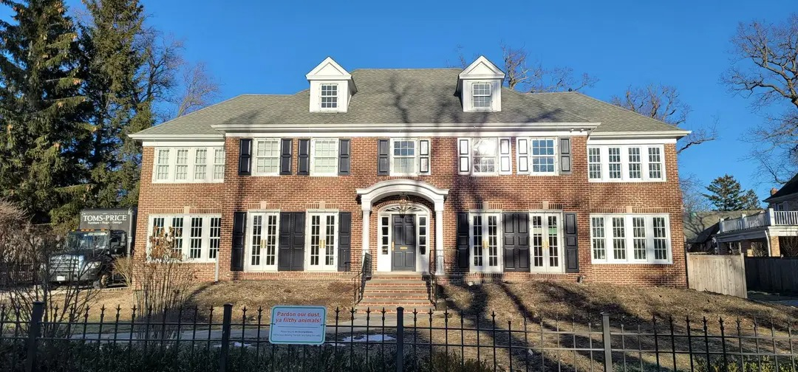

# Prognozowanie szeregów czasowych: „Kevin sam w domu” i temperatura w Polsce



<sub>Dom z filmu, Winnetka, Illinois. Fot. Kidfly182, <a href="https://commons.wikimedia.org/wiki/File:Home_Alone_House_2026.jpg">Wikimedia Commons</a>, CC BY 4.0.</sub>

Co roku w grudniu Polacy szukają „Kevin sam w domu”. Projekt sprawdza, który model najlepiej prognozuje ten szczyt. Drugi szereg, średnioroczna temperatura w Polsce, służy do porównania modeli na danych bez sezonowości.

| | |
|---|---|
| **Szeregi** | Google Trends „Kevin sam w domu”, miesięcznie 2004–2025 (264 obs.) · średnioroczna temperatura w Polsce 1901–2025 (125 obs.) |
| **Modele** | SARIMA, Holt-Winters · ARIMA, Holt, SES, metoda naiwna, błądzenie losowe z dryfem |
| **Testy** | ADF z testem Breuscha-Godfreya · Ljung-Box · Jarque-Bera · LR · ANOVA i Kruskal-Wallis dla sezonowości |
| **Ocena** | prognozy out-of-sample, MAE / RMSE / MAPE ex post |
| **Narzędzia** | R: `forecast`, `tseries`, `urca`, `lmtest` |
| **Kontekst** | projekt z Analizy Szeregów Czasowych, WNE UW, 2026 |

## Wyniki: „Kevin sam w domu”


- Szczyt przypada zawsze na grudzień. Trend rośnie do ok. 2022 roku.
- Próba ucząca: 2004–2024. Próba testowa: 2025.
- Wybrany model: **SARIMA(0,0,1)(1,0,0)[12]**. Test Ljunga-Boxa (p = 0,020) wskazuje resztkową autokorelację.
- **Holt-Winters addytywny** ma mniejsze błędy absolutne: MAE 1,95 i RMSE 3,33. SARIMA ma mniejszy błąd procentowy: MAPE 35,2% wobec 44,7%.
- Wariant multiplikatywny Holta-Wintersa odpada, bo szereg zawiera zera.
- Grudzień 2025: wartość rzeczywista 91, Holt-Winters 80,7, SARIMA 77,0.

| | |
|---|---|
|  |  |
| Dekompozycja addytywna | Sezonowość wyszukiwań |


## Wyniki: temperatura

- Szereg ma wyraźny trend rosnący.
- Próba ucząca: 1901–2023. Próba testowa: 2024–2025.
- Wybrany model: **ARIMA(4,0,1)**. Reszty bez autokorelacji (Ljung-Box p = 0,36). Test LR: składnik MA(1) istotnie poprawia ARIMA(4,0,0) (p < 0,001).
- ARIMA ma mniejsze błędy niż Holt: RMSE 0,757 wobec 0,772, MAPE 5,1% wobec 6,6%.
- Najmniejszy błąd ex post ma **metoda naiwna** (RMSE 0,655). Najlepsze dopasowanie in-sample ma Holt.
- Prognoza ARIMA na lata 2026–2028: 9,6 °C, 9,3 °C, 9,6 °C.

| | |
|---|---|
|  |  |
| Trend średniorocznej temperatury | Prognozy out-of-sample |

## Dane

| Plik | Źródło |
|---|---|
| [`sezonowy/kevin2004teraz.csv`](sezonowy/kevin2004teraz.csv) | [Google Trends](https://trends.google.com/trends/explore?date=all&geo=PL&q=Kevin%20sam%20w%20domu), fraza „Kevin sam w domu”, Polska |
| [`niesezonowy/dane/worldbank.json`](niesezonowy/dane/worldbank.json) | [World Bank Climate Change Knowledge Portal](https://climateknowledgeportal.worldbank.org/country/poland), seria CRU cru-x0.5, 1901–2024 |
| [`niesezonowy/dane/sredniorocznaT.csv`](niesezonowy/dane/sredniorocznaT.csv) | [IMGW-PIB, dane publiczne](https://danepubliczne.imgw.pl/), rok 2025 |

## Uruchomienie

```r
# w katalogu repozytorium
source("projekt_asc.R")
```

Skrypt instaluje brakujące pakiety do `Rlib/`. Wykresy, tabele i podsumowanie zapisuje w `latex/`.

## Licencja

Kod: [MIT](LICENSE). Wykresy: CC BY 4.0. Zdjęcie: CC BY 4.0, autor Kidfly182.
