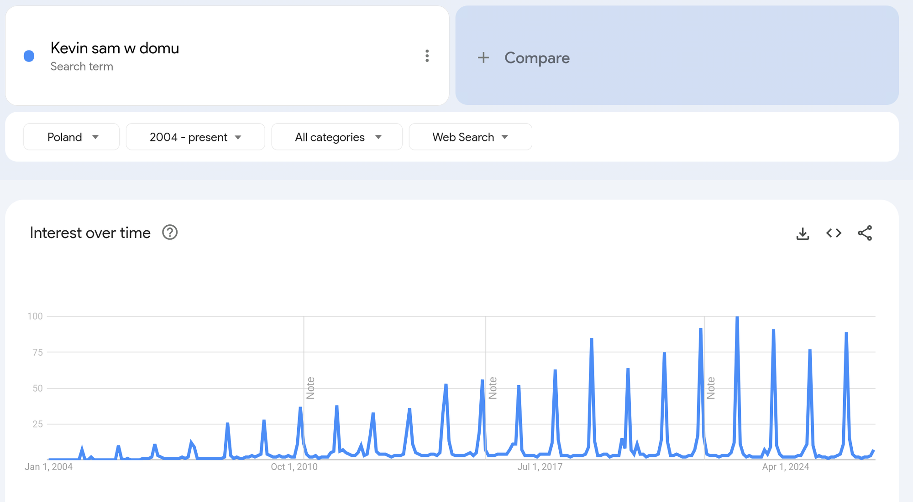
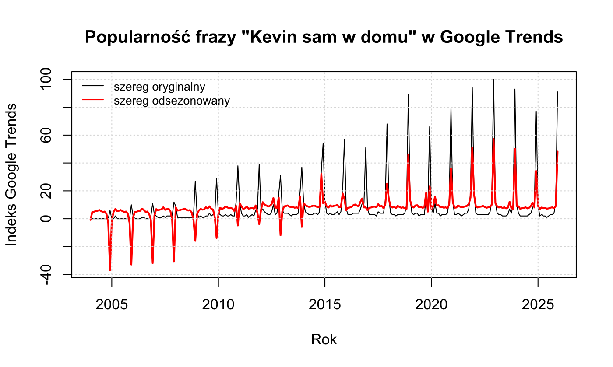
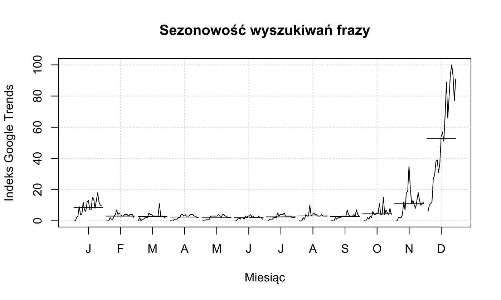
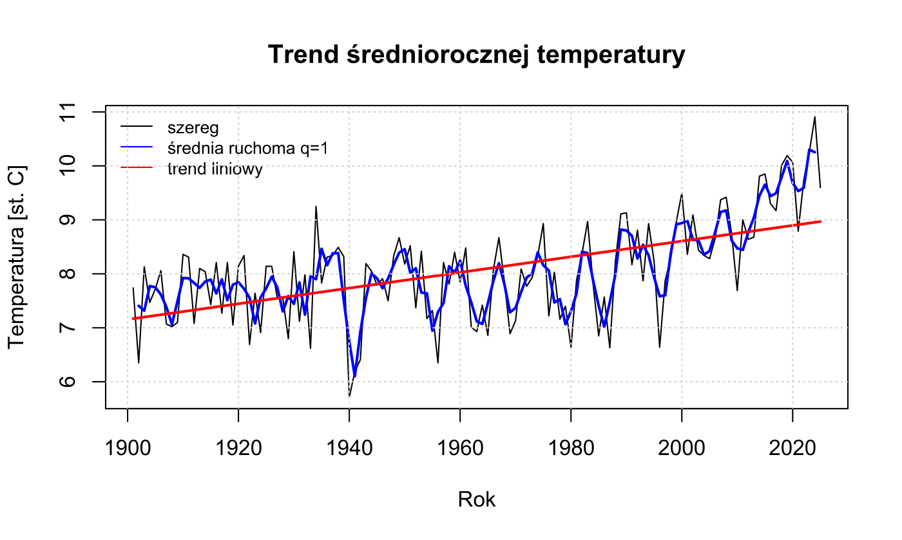
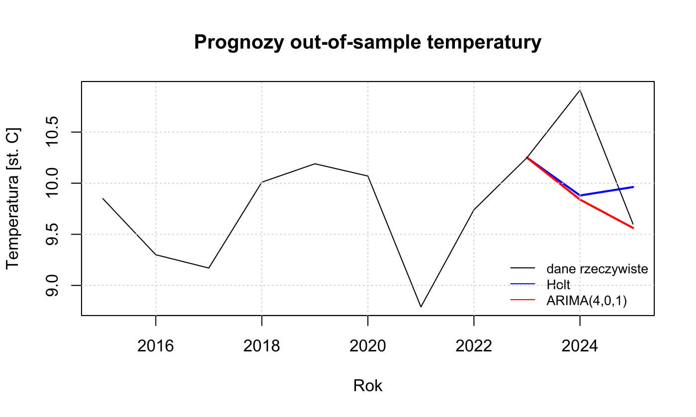

# Prognozowanie szeregów czasowych: „Kevin sam w domu” i temperatura w Polsce


Który model najlepiej przewiduje grudniowy szczyt wyszukiwań „Kevin sam w domu”?

Intuicja podpowiada, że „Kevin sam w domu” to dla wielu Polaków świąteczny rytuał wspólnego oglądania. Sprawdzam, czy wyszukiwania tej frazy w Google są rzeczywiście sezonowe i który model najlepiej prognozuje ich grudniowy szczyt. Drugi szereg, średnioroczna temperatura w Polsce, służy do porównania modeli na danych bez sezonowości. Projekt z Analizy Szeregów Czasowych, WNE UW, 2026.

**Dane:** Google Trends z lat 2004–2025 (264 miesiące) i temperatura z lat 1901–2025 (125 lat)

**Modele:** SARIMA, Holt-Winters, ARIMA, Holt, SES, metoda naiwna, błądzenie losowe z dryfem

**Testy:** ADF z testem Breuscha-Godfreya, Ljunga-Boxa, Jarque-Bera, LR, ANOVA i Kruskala-Wallisa dla sezonowości

**Ocena:** prognozy out-of-sample, MAE, RMSE i MAPE ex post

&nbsp; `forecast` `tseries` `urca` `lmtest`

<br clear="right">

## „Kevin sam w domu”

| Dane w Google Trends |
|:-:|
| <a href="https://trends.google.com/trends/explore?date=all&geo=PL&q=Kevin%20sam%20w%20domu"></a> |
| Co roku jeden ostry szczyt w grudniu. Kliknij obrazek, żeby otworzyć aktualny wykres. |

| Ten sam szereg w R |
|:-:|
|  |
| Czarna linia to indeks Google Trends, czerwona to szereg po usunięciu sezonowości. |

- Szereg jest wyraźnie sezonowy: szczyt przypada zawsze na grudzień. Trend rośnie do ok. 2022 roku.
- Próba ucząca: 2004–2024. Próba testowa: 2025.
- Wybrany model: **SARIMA(0,0,1)(1,0,0)[12]**. Test Ljunga-Boxa (p = 0,020) wskazuje resztkową autokorelację.
- **Holt-Winters addytywny** ma mniejsze błędy absolutne: MAE 1,95 i RMSE 3,33. SARIMA ma mniejszy błąd procentowy: MAPE 35,2% wobec 44,7%.
- Wariant multiplikatywny Holta-Wintersa odpada, bo szereg zawiera zera.
- Grudzień 2025: wartość rzeczywista 91, Holt-Winters 80,7, SARIMA 77,0.

| Dekompozycja |
|:-:|
|  |
| Szereg rozłożony na trend, powtarzalny wzór sezonowy i resztę. |

| Sezonowość | Prognozy out-of-sample |
|:-:|:-:|
|  |  |
| Wartości z kolejnych lat pogrupowane według miesięcy. Pozioma kreska to średnia miesiąca. Grudzień wyraźnie dominuje. | Prognozy na 2025 rok na tle danych rzeczywistych. Oba modele trafiają w grudniowy szczyt, ale go zaniżają. |

## Temperatura w Polsce

- Szereg ma wyraźny trend rosnący.
- Próba ucząca: 1901–2023. Próba testowa: 2024–2025.
- Wybrany model: **ARIMA(4,0,1)**. Reszty bez autokorelacji (Ljung-Box p = 0,36). Test LR: składnik MA(1) istotnie poprawia ARIMA(4,0,0) (p < 0,001).
- ARIMA ma mniejsze błędy niż Holt: RMSE 0,757 wobec 0,772, MAPE 5,1% wobec 6,6%.
- Najmniejszy błąd ex post ma **metoda naiwna** (RMSE 0,655). Najlepsze dopasowanie in-sample ma Holt.
- Prognoza ARIMA na lata 2026–2028: 9,6 °C, 9,3 °C, 9,6 °C.

| Trend |
|:-:|
|  |
| Temperatura roczna, średnia ruchoma i trend liniowy. Według trendu liniowego temperatura wzrosła od 1901 roku o 1,8 °C. |

| Prognozy out-of-sample |
|:-:|
|  |
| Prognozy na lata 2024–2025. Żaden model nie przewidział rekordowo ciepłego 2024 roku. |

## Ocena modelu

- **Mała próba testowa.** Prognozy „Kevina” oceniam na 12 miesiącach, a temperatury na 2 latach. Ranking modeli może się zmienić przy innym okresie testowym.
- **Granica stacjonarności.** Sezonowy parametr SARIMA wynosi 1,000 (sar1, błąd standardowy ≈ 0). To sygnał, że sezonowość jest niemal deterministyczna i model jest na granicy niestacjonarności.
- **Reszty SARIMA** nie są białym szumem (Ljung-Box p = 0,020) ani normalne (Jarque-Bera p < 0,001). Przedziały prognoz z tego modelu byłyby niewiarygodne.
- **MAPE przy małych wartościach.** Od lutego do października indeks wynosi 1–4, więc błąd o 1 punkt to kilkadziesiąt procent. Stąd MAPE 35–45%. Dla tego szeregu bardziej miarodajne są MAE i RMSE.
- **Benchmark.** Na temperaturze metoda naiwna pokonała ARIMA i Holta. Złożony model nie zawsze prognozuje lepiej niż prosta reguła.
- **Dane Google Trends** to indeks względny (0–100), przeliczany przy każdym pobraniu. Nowe pobranie może dać nieco inne wartości.

## Pojęcia

**Out-of-sample i in-sample.** Model szacuję tylko na części danych (próba ucząca), a prognozy porównuję z latami, których model nie widział (próba testowa). To jest test out-of-sample. Dopasowanie in-sample mierzy, jak model odtwarza dane, na których był szacowany. Dobre dopasowanie in-sample nie gwarantuje dobrych prognoz.

**Błędy ex post** liczy się po fakcie, porównując prognozę z rzeczywistą wartością:
- **MAE:** średni błąd bezwzględny, w jednostkach szeregu,
- **RMSE:** pierwiastek ze średniego kwadratu błędu, mocniej karze duże pomyłki,
- **MAPE:** średni błąd procentowy, pozwala porównywać szeregi o różnej skali.

**Sezonowość** to wzór powtarzający się co roku o tej samej porze. **Dekompozycja addytywna** rozkłada szereg na sumę trendu, składnika sezonowego i reszty.

**Stacjonarność** oznacza stałą średnią i wariancję w czasie. Część ARMA modelu wymaga szeregu stacjonarnego, a różnicowanie (d w ARIMA) do niego prowadzi. **Test ADF** sprawdza hipotezę o pierwiastku jednostkowym, czyli niestacjonarności. **Test Breuscha-Godfreya** sprawdza, czy reszty regresji testowej ADF nie są autokorelowane. Gdyby były, wynik ADF byłby niewiarygodny.

**ACF i PACF** pokazują korelację szeregu z jego wartościami sprzed 1, 2, … okresów. Na ich podstawie dobiera się rzędy modelu ARIMA.

**ARIMA(p, d, q):** p to liczba opóźnień szeregu, d to liczba różnicowań, q to liczba opóźnień błędu. **SARIMA(p, d, q)(P, D, Q)[12]** dodaje część sezonową dla okresu 12 miesięcy.

**Wygładzanie wykładnicze** prognozuje na podstawie średniej ważonej z wagami malejącymi dla starszych obserwacji:
- **SES:** sam poziom szeregu,
- **Holt:** poziom i trend,
- **Holt-Winters:** poziom, trend i sezonowość. Wariant addytywny zakłada stałą amplitudę sezonowości, multiplikatywny amplitudę proporcjonalną do poziomu szeregu.

**Modele odniesienia:** metoda naiwna przyjmuje jako prognozę ostatnią obserwację. Błądzenie losowe z dryfem dodaje do niej średnią zmianę z przeszłości. Jeśli złożony model nie wygrywa z nimi, nie wnosi wartości.

**Diagnostyka reszt:** test Ljunga-Boxa sprawdza, czy w resztach nie została autokorelacja, której model nie wychwycił. Test Jarque-Bera sprawdza normalność reszt. Test LR porównuje model prostszy z rozbudowanym.

**ANOVA i test Kruskala-Wallisa** sprawdzają, czy wartości szeregu różnią się istotnie między miesiącami.

## Kod

Cała analiza jest w jednym skrypcie [`projekt_asc.R`](projekt_asc.R).

| | Fragment | Zawartość |
|:-:|---|---|
|  | [Temperatura](projekt_asc.R#L42-L701) | trend, dekompozycja, Holt i modele ekstrapolacyjne, dobór ARIMA, test LR, ADF, diagnostyka reszt, prognozy |
|  | [Kevin&nbsp;sam&nbsp;w&nbsp;domu](projekt_asc.R#L703-L1311) | dekompozycja, Holt-Winters, dobór SARIMA, ADF po różnicowaniu, testy sezonowości, diagnostyka reszt, prognozy |
|  | [Tabele](projekt_asc.R#L1312-L1536) | tabele do raportu, podsumowanie liczbowe |

```r
# w katalogu repozytorium
remotes::install_deps()   # pakiety z pliku DESCRIPTION
source("projekt_asc.R")
```

Skrypt instaluje brakujące pakiety do `Rlib/`. Wyniki zapisuje w `latex/`.

## Dane

- [Google Trends](https://trends.google.com/trends/explore?date=all&geo=PL&q=Kevin%20sam%20w%20domu): fraza „Kevin sam w domu”, Polska → [`sezonowy/kevin2004teraz.csv`](sezonowy/kevin2004teraz.csv)
- [World Bank Climate Change Knowledge Portal](https://climateknowledgeportal.worldbank.org/country/poland): seria CRU, 1901–2024 → [`niesezonowy/dane/worldbank.json`](niesezonowy/dane/worldbank.json)
- [IMGW-PIB, dane publiczne](https://danepubliczne.imgw.pl/): rok 2025 → [`niesezonowy/dane/sredniorocznaT.csv`](niesezonowy/dane/sredniorocznaT.csv)

## Licencja

Kod: [MIT](LICENSE). Wykresy własne: CC BY 4.0. Zrzut ekranu: Google Trends.
