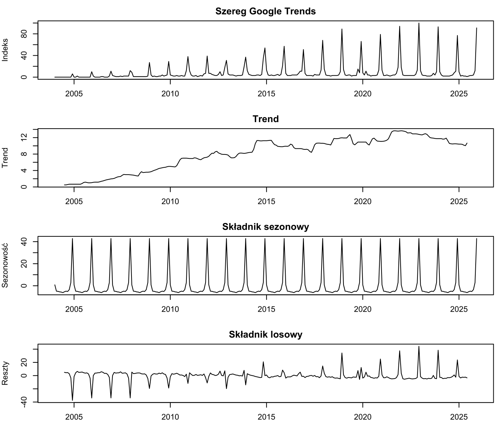
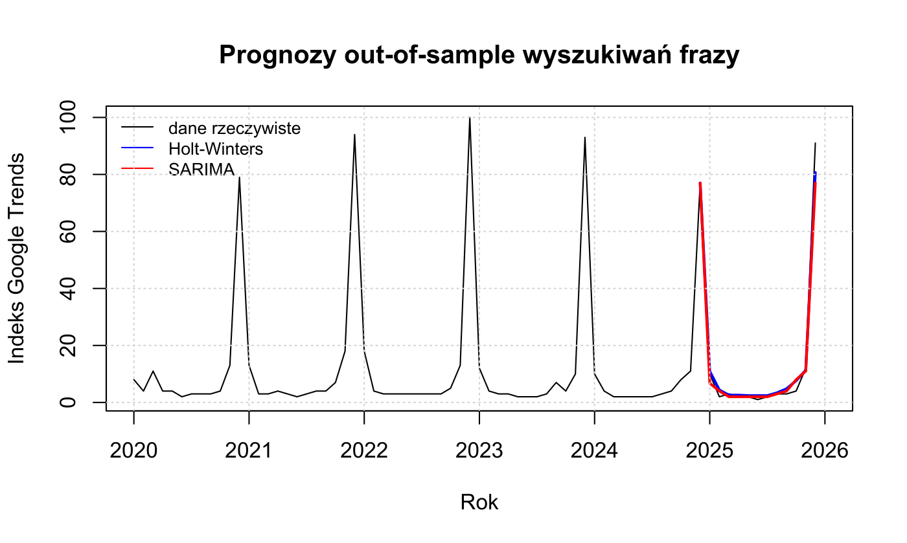

# Analiza szeregów czasowych: temperatura w Polsce i „Kevin sam w domu”

Projekt zaliczeniowy z Analizy Szeregów Czasowych (WNE UW, 2026). Analizuję dwa szeregi: niesezonowy (średnioroczna temperatura w Polsce, 1901–2025) i sezonowy (miesięczna popularność frazy „Kevin sam w domu” w Google Trends, 2004–2025). Porównuję modele ekstrapolacyjne z modelami ARIMA/SARIMA na prognozach out-of-sample.

**Metody:** średnia ruchoma i trend liniowy · dekompozycja addytywna · test ADF z kontrolą autokorelacji reszt (Breusch-Godfrey) · ACF/PACF · ARIMA / SARIMA · Holt, Holt-Winters, SES, metoda naiwna, błądzenie losowe z dryfem · test Ljunga-Boxa, Jarque-Bera, test LR · ANOVA i Kruskal-Wallis dla sezonowości · MAE / RMSE / MAPE ex post

**Narzędzia:** R (`forecast`, `tseries`, `urca`, `lmtest`)


## Szereg sezonowy: „Kevin sam w domu”

- 264 obserwacje miesięczne (2004-01 – 2025-12). Szereg ma wyraźną **sezonowość z pikiem w grudniu** i rosnący trend do ok. 2022 roku.
- Model uczę do 2024 roku, a rok 2025 służy do testu prognoz.
- Wybrany model: **SARIMA(0,0,1)(1,0,0)[12]**. Test Ljunga-Boxa (p = 0,020) wskazuje, że w resztach pozostaje część autokorelacji.
- **Holt-Winters addytywny** daje mniejsze błędy absolutne (MAE 1,95; RMSE 3,33), a SARIMA mniejszy błąd procentowy (MAPE 35,2% wobec 44,7%). Wariant multiplikatywny nie jest dostępny, bo szereg zawiera zera.
- Grudzień 2025: wartość rzeczywista 91, Holt-Winters 80,7, SARIMA 77,0.

| | |
|---|---|
|  |  |
| Dekompozycja addytywna | Sezonowość wyszukiwań frazy |



## Szereg niesezonowy: średnioroczna temperatura

- 125 obserwacji rocznych (1901–2025). Dane 1901–2024 pochodzą z World Bank CCKP (seria CRU), rok 2025 z IMGW.
- Szereg ma **wyraźny trend rosnący**. Model uczę do 2023 roku, a lata 2024–2025 służą do testu prognoz.
- Wybrany model: **ARIMA(4,0,1)**. Brak autokorelacji reszt (Ljung-Box p = 0,36). Test LR potwierdza, że składnik MA(1) istotnie poprawia ARIMA(4,0,0).
- Na próbie testowej ARIMA ma mniejsze błędy niż model Holta (RMSE 0,757 wobec 0,772; MAPE 5,1% wobec 6,6%). Najmniejszy błąd prognozy ex post daje jednak **metoda naiwna** (RMSE 0,655), a najlepsze dopasowanie in-sample ma model Holta.
- Prognoza ARIMA na lata 2026–2028: 9,6 °C, 9,3 °C, 9,6 °C.

| | |
|---|---|
|  |  |
| Trend średniorocznej temperatury | Prognozy out-of-sample temperatury |

## Uruchomienie

```r
# z katalogu repozytorium
source("projekt_asc.R")
```

Skrypt instaluje brakujące pakiety do lokalnego `Rlib/`, a wykresy, tabele i podsumowanie zapisuje w `latex/`.

## Dane

- `niesezonowy/dane/worldbank.json`: World Bank Climate Change Knowledge Portal, seria CRU cru-x0.5
- `niesezonowy/dane/sredniorocznaT.csv`: IMGW, średnioroczna temperatura 2025
- `sezonowy/kevin2004teraz.csv`: Google Trends, fraza „Kevin sam w domu”, Polska

## Licencja

Kod: [MIT](LICENSE). Wykresy: CC BY 4.0.
